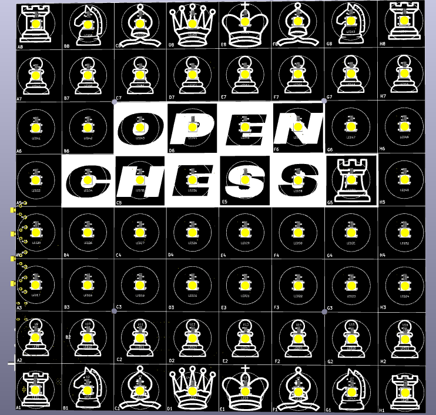
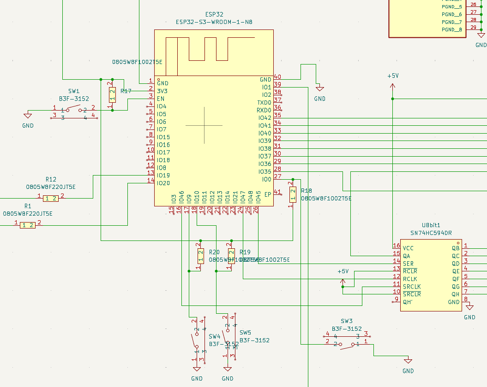
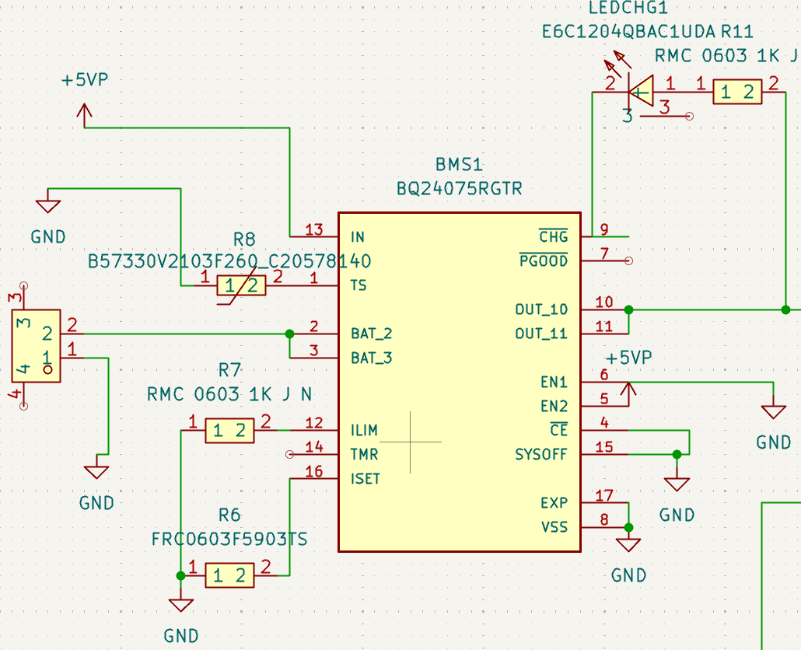

# OpenChess

A programmable smart chess board built on the ESP32-S3. Physical pieces are tracked via a hall-effect sensor matrix, an 8×8 RGBW LED grid lights up under the board, and two buttons let you navigate menus or switch modes. The firmware is plain Arduino — flash it, play it, or rip it apart and build your own game.

---

## Hardware Overview

| Component | Part | Notes |
|---|---|---|
| Microcontroller | ESP32-S3 | USB-C flashing, built-in WiFi & Bluetooth |
| Piece sensors | AH3411 Hall-effect (×64) | One per square, active-LOW when piece present |
| LED matrix | 64 × RGBW NeoPixel | WS2812B-compatible, `NEO_RGBW \| NEO_KHZ800` |
| Column driver | 74HC595 shift register | Drives one column HIGH at a time for scanning |
| Buttons | 2 × momentary tactile | IO9 and IO10, pulled HIGH internally |



### Pin Reference

| GPIO | Function |
|---|---|
| `IO1` | NeoPixel data line |
| `IO45` | Shift register SER (serial data) |
| `IO47` | Shift register RCLK (storage clock / latch) |
| `IO46` | Shift register SRCLK (shift clock) |
| `IO35` | Row 0 sensor input |
| `IO36` | Row 1 sensor input |
| `IO37` | Row 2 sensor input |
| `IO38` | Row 3 sensor input |
| `IO39` | Row 4 sensor input |
| `IO40` | Row 5 sensor input |
| `IO41` | Row 6 sensor input |
| `IO42` | Row 7 sensor input |
| `IO9` | Button A |
| `IO10` | Button B |
| `IO0` | Boot / flash button (hold on power-up to enter flash mode) |
| `EN` → GND | Hardware reset (pulls chip reset line low) |

> **IO0 and EN:** These are not general-purpose user buttons. IO0 held LOW at boot puts the ESP32-S3 into download mode. Tying EN to GND momentarily resets the chip. Both are useful for development but should not be treated as game inputs.



---

## Power

The board uses a **BQ24075RGTR** battery management IC for single-cell LiPo charging and power path management. USB-C input charges the battery while simultaneously powering the board. A dedicated charge-status LED indicates charging state.



---

## Software Setup

1. Install the **Arduino IDE** (2.x recommended).
2. Add the ESP32-S3 board package:
   - In Arduino IDE go to **File → Preferences** and add this URL to *Additional boards manager URLs*:
     ```
     https://raw.githubusercontent.com/espressif/arduino-esp32/gh-pages/package_esp32_index.json
     ```
   - Open **Tools → Board → Boards Manager**, search `esp32`, install **esp32 by Espressif Systems**.
3. Install the required libraries via **Sketch → Include Library → Manage Libraries**:
   - `Adafruit NeoPixel`
   - `ArduinoJson` (required by `bot_chess` only)
4. Select the board: **Tools → Board → ESP32S3 Dev Module** (or your specific variant).
5. Open any `.ino` file from the `Examples/` folder, adjust WiFi credentials if needed, and upload.

---

## Reading the Sensor Matrix

Pieces are detected using a column-scan technique. The 74HC595 shift register activates one column at a time by shifting a single HIGH bit through it. The 8 row GPIO pins are then sampled — a LOW reading means a piece (magnet) is present on that square.

```cpp
#define NUM_ROWS 8
#define NUM_COLS 8

const int ROW_PINS[NUM_ROWS] = {35, 36, 37, 38, 39, 40, 41, 42};

// Activate a single column by shifting one HIGH bit into the 74HC595
void setColumn(int col) {
    digitalWrite(RCLK_PIN, LOW);
    for (int i = 7; i >= 0; i--) {
        digitalWrite(SRCLK_PIN, LOW);
        digitalWrite(SER_PIN, (i == col) ? HIGH : LOW);
        digitalWrite(SRCLK_PIN, HIGH);
    }
    digitalWrite(RCLK_PIN, HIGH);
}

// Scan the full 8×8 grid into sensorState[row][col]
void scanBoard() {
    for (int col = 0; col < NUM_COLS; col++) {
        setColumn(col);
        delayMicroseconds(10); // settle time
        for (int row = 0; row < NUM_ROWS; row++) {
            sensorState[row][col] = (digitalRead(ROW_PINS[row]) == LOW);
        }
    }
}
```

To detect **pick-ups** and **placements**, compare the current scan against the previous one:

```cpp
bool sensorPrev[8][8];
bool sensorState[8][8];

void detectChanges() {
    for (int r = 0; r < 8; r++) {
        for (int c = 0; c < 8; c++) {
            if (sensorPrev[r][c] && !sensorState[r][c]) {
                // Piece lifted from (r, c)
            }
            if (!sensorPrev[r][c] && sensorState[r][c]) {
                // Piece placed on (r, c)
            }
            sensorPrev[r][c] = sensorState[r][c];
        }
    }
}
```

---

## Controlling the LEDs

The 64 LEDs are wired as a flat strip mapped row-by-row. Pixel index is:

```
pixel = row * 8 + col
```

Row 0 is the bottom of the board (White's back rank), row 7 is the top (Black's back rank).

```cpp
#include <Adafruit_NeoPixel.h>

#define LED_PIN   1
#define NUM_LEDS  64

Adafruit_NeoPixel strip(NUM_LEDS, LED_PIN, NEO_RGBW + NEO_KHZ800);

void setup() {
    strip.begin();
    strip.setBrightness(100); // 0–255; ~100 is comfortable for indoor use
    strip.show();
}

// Set one square's color (r=0–7, c=0–7)
// setPixelColor(index, R, G, B, W) — W is the white channel
void setSquare(int r, int c, uint8_t red, uint8_t green, uint8_t blue, uint8_t white) {
    strip.setPixelColor(r * 8 + c, strip.Color(red, green, blue, white));
}

// Call strip.show() once after all setSquare() calls to push the update
void loop() {
    setSquare(0, 0, 255, 0, 0, 0);  // Red on a1
    setSquare(7, 7, 0, 255, 0, 0);  // Green on h8
    strip.show();
}
```

### Useful Color Recipes

| Color | R | G | B | W | Use case |
|---|---|---|---|---|---|
| Warm white | 0 | 0 | 0 | 255 | Highlight / selected piece |
| Red | 255 | 0 | 0 | 0 | Capture / danger |
| Green | 0 | 255 | 0 | 0 | Valid move / success |
| Blue | 0 | 0 | 255 | 0 | Bot move / info |
| Purple | 80 | 0 | 200 | 0 | Ghost / remote pieces |
| Cyan | 0 | 200 | 200 | 0 | Confirmation |
| Orange | 255 | 100 | 0 | 0 | Warning / capture by bot |
| Gold | 255 | 215 | 0 | 255 | Promotion / special event |
| Off | 0 | 0 | 0 | 0 | Clear a square |

---

## Using the Buttons

Both buttons connect to GPIO and are read with the internal pull-up resistor. They read LOW when pressed.

```cpp
#define BTN_A 9   // IO9
#define BTN_B 10  // IO10

void setup() {
    pinMode(BTN_A, INPUT_PULLUP);
    pinMode(BTN_B, INPUT_PULLUP);
}

void loop() {
    if (digitalRead(BTN_A) == LOW) {
        // Button A pressed
    }
    if (digitalRead(BTN_B) == LOW) {
        // Button B pressed
    }
}
```

For debouncing, track the last press time:

```cpp
unsigned long lastPressA = 0;
const unsigned long DEBOUNCE_MS = 200;

void loop() {
    if (digitalRead(BTN_A) == LOW && millis() - lastPressA > DEBOUNCE_MS) {
        lastPressA = millis();
        // Handle press
    }
}
```

---

## Examples

All examples are in the `Examples/` folder. Load them directly in the Arduino IDE — they are self-contained `.ino` files.

### `bot_chess.ino` — WiFi Chess vs. Stockfish AI

Play chess against a Stockfish engine hosted at [chess-api.com](https://chess-api.com). Press **Button B (IO10)** for two-player mode or **Button A (IO9)** for bot mode. In bot mode, set difficulty by placing a pawn on row 4 (rank 5 from White's side) — columns A–H map to levels 1–8 (green = easy, red = hard).

Before uploading, set your WiFi credentials near the top of the file:
```cpp
const char* ssid     = "YourNetworkName";
const char* password = "YourPassword";
```

### `bt_chess.ino` — Physical Two-Board Chess (ESP-NOW)

Connects two OpenChess boards over ESP-NOW (no router needed). Both boards carry all 32 physical pieces. On your turn, pick up a piece and place it — the legal-move LEDs guide you. Your move is sent wirelessly to the other board, which lights the FROM square **orange** and the TO square **green**. The other player must physically move the piece before their turn begins. Roles (White/Black) are assigned automatically by MAC address. Press **Button A (IO9)** to reset and re-pair.

### `ghost_chess.ino` — Ghost Chess (ESP-NOW, Two Boards)

A variant of two-board play where each board only carries its own physical pieces (White keeps rows 1–2, Black keeps rows 7–8). The opponent's pieces are shown as permanent **purple ghost LEDs** — no physical mirroring required. When the opponent captures one of your pieces, that square flashes red until you remove it. Press **Button A (IO9)** to reset and re-pair.

### `pong.ino` — Board Pong

A fully playable Pong game on the 8×8 LED grid. Place a piece anywhere on column A to control the left paddle and a piece on column H for the right paddle. Press **Button B (IO10)** to start or reset. Ball speed increases over time.

---

## Writing Your Own Game

The hardware gives you three things to work with:

1. **64 sensor squares** — detect where physical pieces are placed
2. **64 RGBW LEDs** — display state, animations, and UI
3. **2 buttons** — mode select, confirm, reset

A minimal game skeleton:

```cpp
#include <Adafruit_NeoPixel.h>

#define LED_PIN   1
#define NUM_LEDS  64
#define SER_PIN   45
#define RCLK_PIN  47
#define SRCLK_PIN 46
#define BTN_A     9
#define BTN_B     10

const int ROW_PINS[8] = {35, 36, 37, 38, 39, 40, 41, 42};

Adafruit_NeoPixel strip(NUM_LEDS, LED_PIN, NEO_RGBW + NEO_KHZ800);

bool sensorState[8][8];
bool sensorPrev[8][8];

void setColumn(int col) {
    digitalWrite(RCLK_PIN, LOW);
    for (int i = 7; i >= 0; i--) {
        digitalWrite(SRCLK_PIN, LOW);
        digitalWrite(SER_PIN, (i == col) ? HIGH : LOW);
        digitalWrite(SRCLK_PIN, HIGH);
    }
    digitalWrite(RCLK_PIN, HIGH);
}

void scanBoard() {
    for (int col = 0; col < 8; col++) {
        setColumn(col);
        delayMicroseconds(10);
        for (int row = 0; row < 8; row++) {
            sensorState[row][col] = (digitalRead(ROW_PINS[row]) == LOW);
        }
    }
}

void setup() {
    pinMode(SER_PIN, OUTPUT);
    pinMode(RCLK_PIN, OUTPUT);
    pinMode(SRCLK_PIN, OUTPUT);
    for (int i = 0; i < 8; i++) pinMode(ROW_PINS[i], INPUT_PULLUP);
    pinMode(BTN_A, INPUT_PULLUP);
    pinMode(BTN_B, INPUT_PULLUP);

    strip.begin();
    strip.setBrightness(100);
    strip.show();

    scanBoard();
    memcpy(sensorPrev, sensorState, sizeof(sensorState));
}

void loop() {
    scanBoard();

    for (int r = 0; r < 8; r++) {
        for (int c = 0; c < 8; c++) {
            // Piece placed
            if (!sensorPrev[r][c] && sensorState[r][c]) {
                strip.setPixelColor(r * 8 + c, strip.Color(0, 255, 0, 0));
            }
            // Piece lifted
            if (sensorPrev[r][c] && !sensorState[r][c]) {
                strip.setPixelColor(r * 8 + c, strip.Color(0, 0, 0, 0));
            }
            sensorPrev[r][c] = sensorState[r][c];
        }
    }

    strip.show();
    delay(20);
}
```

This skeleton lights a square green when a piece is placed on it and turns it off when the piece is lifted. Build your game logic on top of this pattern.

---

## Coordinate System

```
Col:  0   1   2   3   4   5   6   7
      A   B   C   D   E   F   G   H

Row 7  ┌───┬───┬───┬───┬───┬───┬───┬───┐  ← Black back rank
Row 6  │   │   │   │   │   │   │   │   │
Row 5  │   │   │   │   │   │   │   │   │
Row 4  │   │   │   │   │   │   │   │   │
Row 3  │   │   │   │   │   │   │   │   │
Row 2  │   │   │   │   │   │   │   │   │
Row 1  │   │   │   │   │   │   │   │   │
Row 0  └───┴───┴───┴───┴───┴───┴───┴───┘  ← White back rank
```

`sensorState[row][col]` — `true` means a piece is present. Pixel index = `row * 8 + col`.

---

## Dependencies

| Library | Install via |
|---|---|
| Adafruit NeoPixel | Arduino Library Manager |
| ArduinoJson | Arduino Library Manager (`bot_chess` only) |
| esp_now | Built into ESP32 Arduino core (`bt_chess` only) |
| WiFi / WiFiClientSecure / HTTPClient | Built into ESP32 Arduino core (`bot_chess` only) |
